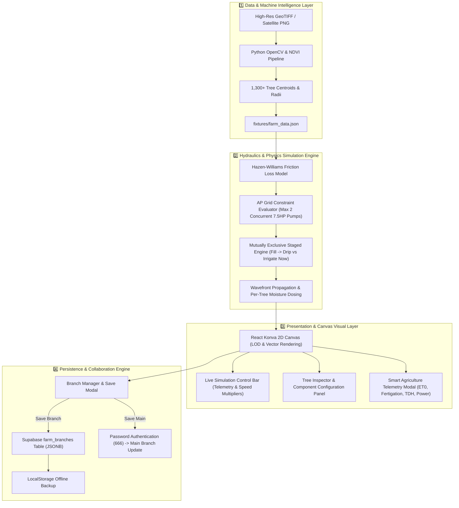

# 🌴 Coconut Plantation Digital Twin: Architecture & Engineering Context

> **Authoritative Technical Documentation & Architectural Reference**  
> **Location:** Madhu Coconut Plantation (25 Acres, Andhra Pradesh, India)  
> **Live Production:** [https://madhu-coco-farm.vercel.app](https://madhu-coco-farm.vercel.app)  
> **GitHub:** [https://github.com/abhay2008/coconut-farm-digital-twin](https://github.com/abhay2008/coconut-farm-digital-twin)  
> **Database:** Supabase PostgreSQL Cloud Sync (`tqhoejmonbajbyqgswac.supabase.co`)

---

## 📌 Executive Summary

This document provides a deep-dive architectural and real-world engineering reference for the **Coconut Plantation Digital Twin & Hydrological Platform**. The system manages **1,300+ individual coconut palm digital twins** mapped over a **25-acre** plantation layout in Andhra Pradesh, India.

It integrates:
1. **Computer Vision Canopy Detection Pipeline** (Python / OpenCV) for automated tree extraction from high-resolution satellite imagery.
2. **Dynamic Hydraulic Physics Engine** (TypeScript / Hazen-Williams) calculating head loss, flow velocity, and pressure distribution across 110mm mainlines, 75mm sublines, 40mm ladders, and 16mm drip loops.
3. **Real-World AP Transco 3-Phase Grid Constraints Engine** enforcing exclusive two-stage operation (Borewell Fill vs Submersible Fertigation).
4. **Interactive 2D Canvas & Telemetry** (React Konva) supporting dynamic drag-and-drop component placement, live parent-child motor vector binding, and pressure heatmaps.
5. **3-Tier Persistence & Branching System** (Supabase Cloud PostgreSQL + Serverless REST API + LocalStorage) for multi-user collaboration and password-protected main branch version control.

---

## 🏗️ System Architecture & Subsystem Interactions



---

## 🌊 Real-World AP Agricultural Physics & Hydrology

### ⚡ 1. AP Transco 3-Phase Grid Power Constraints
In rural Andhra Pradesh, agricultural feeders receive 3-phase electricity for limited windows (typically **9 hours per day**). Furthermore, local Distribution Transformers (DTR) impose current draw limits:
- **Maximum Concurrent Power Limit**: $15\text{ HP}$ total connected load per feeder branch.
- **Borewell Operation (Stage A)**: Running 2 surface monoblocks ($2 \times 7.5\text{ HP} = 15\text{ HP}$) draws $328.6\text{ LPM}$ ($19,714\text{ L/hr} = 5.48\text{ L/sec}$).
- **Submersible Irrigation (Stage B)**: The $10\text{ HP}$ submersible pump draws $586.1\text{ LPM}$ ($35,168\text{ L/hr} = 9.77\text{ L/sec}$).
- **Mutual Exclusivity Rule**: Because $15\text{ HP} + 10\text{ HP} = 25\text{ HP}$ exceeds the feeder capacity, borewells **cannot run simultaneously** with the submersible fertigation pump.

---

### 📐 2. 20-Foot Tree Spacing Friction & Pressure Loss
Each coconut palm is spaced **20 feet ($6.10\text{ meters}$)** apart in a regular grid. Lateral pipe runs stretch up to $183\text{ meters}$ ($600\text{ feet}$) per block.

#### Hazen-Williams Friction Formula:
$$h_f = 10.67 \times \frac{L \times Q^{1.852}}{C^{1.852} \times D^{4.87}}$$

Where:
- $L = \text{Pipe length (m)}$
- $Q = \text{Flow rate (m}^3\text{/s)}$
- $C = 140 \text{ (PVC roughness coefficient)}$
- $D = \text{Internal diameter (m)}$

#### Network Pressure Distribution:
| Position in Network | Distance | Pipe Spec | Flow Rate | Operating Pressure | Status |
|---|---|---|---|---|---|
| **Pond Suction Header** | $0\text{ m}$ | $110\text{ mm}$ Mainline | $586\text{ LPM}$ | $3.50\text{ bar}$ | Optimal |
| **Subline Junction** | $45\text{ m}$ | $75\text{ mm}$ Subline | $293\text{ LPM}$ | $2.85\text{ bar}$ | Optimal |
| **Mid-Field Ladder** | $120\text{ m}$ | $40\text{ mm}$ Ladder | $100\text{ LPM}$ | $1.90\text{ bar}$ | Good |
| **Tail-End Dripper Loop** | $183\text{ m}$ | $16\text{ mm}$ Drip Ring | $12\text{ LPM}$ | $0.65\text{ bar}$ | Low (Booster Recommended) |

---

### ⏱️ 3. AP 9-Hour Hydration Math
- **Total Trees**: $1,300$ palms
- **Target Dosing**: $150\text{ Liters / tree / day}$
- **Total Farm Water Required**: $1,300 \times 150\text{ L} = 195,000\text{ Liters}$
- **Submersible Delivery Rate**: $35,168\text{ L/hr}$
- **Total Irrigation Time Required**:
  $$\text{Time} = \frac{195,000\text{ L}}{35,168\text{ L/hr}} = \mathbf{5.54\text{ Hours}}$$
- **Power Window Buffer**: $\mathbf{9.00\text{ hrs}} - \mathbf{5.54\text{ hrs}} = \mathbf{3.46\text{ Hours}}$ buffer for field maintenance and filter flushing.

---

## 🎛️ Interactive Simulation Modes

The digital twin offers two simulation playback modes:

1. **⚙️ `Fill → Drip` Mode (AP Daily Cycle Demo)**:
   - Starts with pond at $500\text{ L}$ (empty start).
   - **Stage A**: 2 borewell monoblocks fill pond to $50,000\text{ L}$ threshold ($\approx 2.53\text{ hrs}$).
   - **Changeover**: Borewells halt; $10\text{ HP}$ submersible pump activates with Venturi fertigation dosing.
   - **Stage B**: Drains pond through drip network to irrigate trees.

2. **💧 `Irrigate Now` Mode (Pre-Filled Storage)**:
   - Starts with pond pre-filled at $450,000\text{ L}$ (accumulated from prior borewell storage days).
   - Immediately executes Stage B submersible fertigation.
   - Hydrates all **1,300+ trees** in **5.54 hours** with live visual wavefront propagation.

---

## ⚡ Smart Agriculture Telemetry Suite

The platform includes a dedicated **Smart Agriculture Analytics Suite** (`src/frontend/src/lib/agriPhysics.ts` + `SmartAgriAnalyticsModal.tsx`):

1. **☀️ Evapotranspiration (ET0) Hargreaves Calculator**: Calculates daily crop evapotranspiration ($ET_c = ET_0 \times K_c$) based on temperature, relative humidity, and solar radiation.
2. **🌊 Open-Water Pond Solar Evaporation Calculator**: Calculates daily solar evaporation water loss ($\text{Liters/day}$) and monthly cumulative loss ($\text{L/month}$) from the 500,000L unshaded central storage pond ($500\text{ m}^2$ surface area).
3. **🧪 Venturi Liquid Fertigation Injector Calculator**: Determines liquid N-P-K fertilizer injection rates ($\text{L/hr}$) and Venturi vacuum differential ($\text{mbar}$).
4. **💧 Total Dynamic Head (TDH) Breakdown**: Calculates static lift head, Hazen-Williams friction loss, minor fitting losses, and required pump motor horsepower.
5. **⚡ AP Free Agricultural Power Grid Tracking**: Calculates daily kWh energy consumption while enforcing the **Andhra Pradesh Government 100% Free Power Policy for Farmers ($\mathbf{\text{₹}0\text{ Tariff}}$)**.

---

## ☁️ Supabase Database & Security

### Table Schema (`farm_branches`)
```sql
create table if not exists farm_branches (
  name text primary key,
  is_main boolean default false,
  farm_data jsonb not null,
  custom_components jsonb default '[]'::jsonb,
  updated_at timestamptz default now()
);
```

### Security & Access Control
- **Branch Editing**: Anyone can create and edit custom layout branches without password authentication.
- **Main Branch Protection**: Overwriting or resetting the primary `main` branch requires password verification (`666`).

---

## 📄 License & Attribution

Developed for **Madhu Coconut Plantation**, Andhra Pradesh, India.  
Open-source under the **MIT License**.
