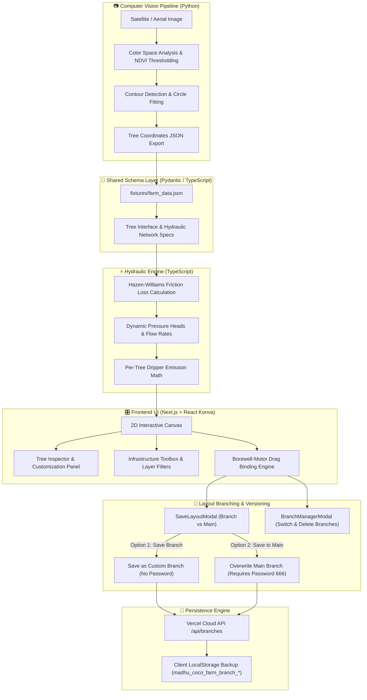

# 🌴 Coconut Plantation Digital Twin & Real-World Engineering Platform

[](https://frontend-mu-tawny-d4xcmpjhrq.vercel.app)
[](https://github.com/abhay2008/coconut-farm-digital-twin)
[](https://nextjs.org/)
[](https://konvajs.org/)
[](https://www.python.org/)
[](LICENSE)

> **A high-precision, real-world engineering digital twin for a 25-acre coconut plantation featuring 1,222 individual tree digital twins, graph-based hydraulic physics modeling, live pump drag-binding, granular pipe layer filters, universal & per-tree dripper hole controls, satellite visual controls, layout branching & versioning, password-protected main saves (`666`), and cloud API persistence.**

---

## 🌐 Live Production Demo

🚀 **Explore the Live Web App:** [https://madhu-coco-farm.vercel.app](https://madhu-coco-farm.vercel.app) (or [https://frontend-mu-tawny-d4xcmpjhrq.vercel.app](https://frontend-mu-tawny-d4xcmpjhrq.vercel.app))  
📦 **GitHub Repository:** [https://github.com/abhay2008/coconut-farm-digital-twin](https://github.com/abhay2008/coconut-farm-digital-twin)

---

## 📑 Table of Contents

- [🌟 Overview & System Highlights](#-overview--system-highlights)
- [🏗️ System Architecture & Data Flow](#️-system-architecture--data-flow)
- [📖 User Guide & Feature Walkthrough](#-user-guide--feature-walkthrough)
  - [1. Canvas Navigation & Visual Controls](#1-canvas-navigation--visual-controls)
  - [2. 1,222 Tree Twins & Tree Inspector](#2-1222-tree-twins--tree-inspector)
  - [3. Real-World Hydraulics & Pipe Layer Filtering](#3-real-world-hydraulics--pipe-layer-filtering)
  - [4. Dynamic Borewell & Surface Motor Drag-Binding](#4-dynamic-borewell--surface-motor-drag-binding)
  - [5. Universal & Per-Tree Dripper Hole Control](#5-universal--per-tree-dripper-hole-control)
  - [6. Storage Pond & Fertigation Unit](#6-storage-pond--fertigation-unit)
  - [7. Layout Branching, Versioning & Cloud Sync](#7-layout-branching-versioning--cloud-sync)
- [📐 Real-World Engineering Specifications](#-real-world-engineering-specifications)
- [🚀 Quick Start & Local Setup](#-quick-start--local-setup)
- [🛠️ Tech Stack](#️-tech-stack)
- [📄 License](#-license)

---

## 🌟 Overview & System Highlights

This platform translates complex agricultural hydrology, computer vision canopy detection, and real-world pipe network dynamics into an intuitive, high-performance interactive web application.

```
       🌴 1,222 Tree Twins       💧 10 HP Submersible Pump        🌊 500,000 L Storage Pond
  ─────────────────────────────────────────────────────────────────────────────────────────────
       🔴 110mm Main Lines       🔵 75mm Sublines                🟠 40mm Ladder Pipes
       🔄 16mm Drip Loops        ⚡ 7 Surface Monoblock Motors   🔒 Password-Protected Main
```

### Key Capabilities
- **🌴 1,222 Coconut Palm Digital Twins**: Every single tree is tracked with individual coordinates, age categories (Young $0\text{–}3\text{ yrs}$, Medium $4\text{–}8\text{ yrs}$, Mature $9+\text{ yrs}$), health index ($0.0\text{–}1.0$), yield history, and custom dripper emission rates.
- **⚡ Real-World Motor Architecture**: Features **1 Submersible Pump (10 HP)** inside the Storage Pond and **7 Surface Monoblock Motors** positioned at borewell wellheads + **1 Surface Booster Pump** on sublines.
- **🌿 Layout Branching & Versioning**: Create custom branches (e.g. `North Sector Test`) to experiment with layouts without altering the primary farm plan.
- **🔒 Password-Protected Main Branch**: Saving to or resetting the default `main` branch requires security password verification.
- **💧 Dynamic Hazen-Williams Hydraulic Engine**: Computes friction losses, flow rates ($\text{LPM}$), and dynamic pressure distribution across all sub-networks in real time.
- **🔗 Synchronized Parent-Child Drag Binding**: Dragging any Borewell automatically moves its paired Surface Monoblock Motor and recalculates cyan delivery line vectors to the storage pond instantly.
- **🎛️ Granular Pipeline Layer Filtering**: Independent toggle checkboxes for Mainlines ($110\text{ mm}$), Sublines ($75\text{ mm}$), Ladders ($40\text{ mm}$), Drip Loops ($16\text{ mm}$), and Well/Pond lines.
- **🎚️ Universal & Per-Tree Dripper Control**: Universal hole slider ($1\text{ to }16$ holes per ring) with a `Set All (1,222)` button + per-tree inspection panel overrides. Dynamic blue microsprinkler dots render visually on the canvas around each tree.
- **👁️ Visual Contrast & Satellite Dimming**: Opacity slider ($10\%\text{ to }100\%$) for satellite imagery + **High-Contrast Pipe Mode** (dark outline stroke backing for maximum visibility).
- **💾 Cloud REST API & Local Backup**: Serverless `/api/branches` API coupled with instant client `localStorage` sync.

---

## 🏗️ System Architecture & Data Flow



---

## 📖 User Guide & Feature Walkthrough

### 1. Canvas Navigation & Visual Controls

The main viewport displays an annotated 25-acre satellite canvas powered by high-performance 2D canvas rendering (React Konva).

- **Zooming**: Use mouse scroll wheel or pinch gesture to zoom in from macro farm overview ($0.3\times$) down to micro tree detail ($3.0\times$).
- **Panning**: Click and drag on empty canvas background to pan across the 25-acre plantation layout.
- **Satellite Map Opacity**: Locate the **Satellite Map Opacity** slider in the left-hand **Infrastructure Toolbox**. Slide from $100\%$ down to $10\%$ to dim the terrain background image, making vector pipe lines pop out cleanly.
- **✨ High-Contrast Pipe Mode**: Toggle the **High-Contrast Pipe Mode** checkbox in the toolbox. This adds a dark outline stroke behind all pipes, making $110\text{ mm}$, $75\text{ mm}$, and $40\text{ mm}$ pipelines distinct regardless of underlying ground color.

> [!TIP]
> Use **High-Contrast Pipe Mode** combined with **$30\%$ Satellite Opacity** for the crispest engineering blueprint view when inspecting pipe joints and valves.

---

### 2. 1,222 Tree Twins & Tree Inspector

Every single tree on the farm is a live digital twin with full telemetry data.

```
       🔴 Red Dot / Ring          = Tree Center & Canopy Bounds
       🔵 Blue Dots               = Active Dripper Holes (1 to 16)
       🟢 Green Canopy Fill       = Healthy Tree (Optimal Pressure & Moisture)
       🟡 Yellow Canopy Fill      = Under-Irrigated Warning State
```

#### Inspecting a Tree:
1. Click on any tree on the canvas.
2. The **Tree Inspector Panel** will slide open on the right.
3. View tree telemetry:
   - **Tree ID**: e.g., `TREE-0421`
   - **Variety**: West Coast Tall / Malayan Yellow Dwarf
   - **Age**: Category & years (Young $0\text{–}3\text{ yrs}$, Medium $4\text{–}8\text{ yrs}$, Mature $9+\text{ yrs}$)
   - **Health Index**: Real-time calculated score ($0.0\text{–}1.0$)
   - **Calculated Water Flow**: Real-time flow rate in Liters Per Hour ($\text{LPH}$) based on current line pressure
   - **Microsprinkler / Dripper Holes**: Adjustable slider ($1\text{ to }16$ holes) specifically for this tree

---

### 3. Real-World Hydraulics & Pipe Layer Filtering

The network accurately reflects professional agricultural drip irrigation design with color-coded pipe schedules:

| Pipeline Layer | Outer Diameter | Standard Color | Function & Routing |
| :--- | :--- | :--- | :--- |
| **Mainline** | $110\text{ mm}$ PVC | 🔴 Crimson Red | Primary feeder line from Fertigation Unit |
| **Subline** | $75\text{ mm}$ PVC | 🔵 Deep Blue | Sector distribution lines servicing block rows |
| **Ladder Line** | $40\text{ mm}$ HDPE | 🟠 Amber Orange | Manifold lines bridging tree sub-sectors |
| **Drip Loop** | $16\text{ mm}$ LLDPE | 🔄 Emerald Ring | Circular ring encircling tree root zone |
| **Well & Pond Lines** | $90\text{ mm}$ Flexible | 🩵 Cyan Dashed | Raw water extraction lines from borewells to pond |

#### Granular Pipe Layer Filters:
In the **Infrastructure Toolbox**, use the **Pipeline Layer Filter** checkboxes to isolate specific pipe types:
- `[x] 🔴 Mainlines (110mm)`
- `[x] 🔵 Sublines (75mm)`
- `[x] 🟠 Ladders (40mm)`
- `[x] 🔄 Drip Loops (16mm)`
- `[x] 💧 Well & Pond Lines`

---

### 4. Dynamic Borewell & Surface Motor Drag-Binding

In real-world engineering, a borewell wellhead requires a dedicated **Surface Monoblock Motor** mounted directly beside the well casing.

#### How Drag-Binding Works:
1. Locate any of the **7 Borewells** (blue well icons) or **7 Surface Monoblock Motors** (pump icons) on the canvas.
2. Click and drag a Borewell to a new location.
3. **Automated Parent-Child Movement**: The paired Surface Monoblock Motor automatically moves with the borewell at a synchronized $+15\text{px}$ offset.
4. **Real-time Recalculation**: The cyan dashed delivery line connecting the borewell motor to the Storage Pond dynamically recalculates its path and length in real time. The Hazen-Williams friction loss engine immediately updates system pressure dynamics.

---

### 5. Universal & Per-Tree Dripper Hole Control

Each tree drip ring supports between $1$ and $16$ emitter holes / microsprinklers around its perimeter.

#### Universal Dripper Hole Control:
1. Open the **Infrastructure Toolbox** on the left.
2. Locate the **Universal Dripper Hole Control** slider.
3. Slide to choose your target dripper holes (e.g. $4$, $8$, or $12$ holes).
4. Click **`Set All (1,222)`**.
5. All $1,222$ tree twins will instantly update their dripper count, re-render blue emitter dots on the canvas, and recalculate total farm water consumption.

#### Per-Tree Customization:
- Click an individual tree $\to$ adjust the **Microsprinkler Holes** slider in the Tree Inspector $\to$ that specific tree receives custom emitter density independent of the farm-wide setting.

---

### 6. Storage Pond & Fertigation Unit

- **Storage Pond**: Rotatable $500,000\text{ L}$ lined rainwater storage reservoir located at coordinates $(x: 636, y: 504)$. Powered by **1 Submersible Pump (10 HP)** supplying raw water to the fertigation station.
- **Disc Filter & Fertigation Station**: Located at coordinates $(x: 581, y: 674)$. Integrates a Venturi fertilizer injector and dual disc filters to remove particulate matter before water enters the $110\text{ mm}$ Mainlines.

---

### 7. Layout Branching, Versioning & Cloud Sync

Click **"💾 Save Layout Permanently"** in the toolbox to open the Save Layout modal.

```
       🌿 Option 1: Save as a Branch     → Enter branch name (e.g., North Sector Test). Open access.
       🔒 Option 2: Save to Main Branch → Overwrites main layout. Requires Security Password.
```

#### Default Load Behavior:
- **Automatic Main Branch Load**: Opening or refreshing the website automatically loads the official **`main`** branch layout.

#### Branch Version Manager (`🔀 Switch / Manage`):
- Click **"🔀 Switch / Manage"** in the active branch bar to open the Branch Manager.
- **`Load Branch`**: Instantly switches your canvas to any saved branch layout.
- **`Delete Branch`**: Custom branches can be deleted directly. Deleting or resetting the **`main`** branch **requires Security Password**.

> [!IMPORTANT]
> **Persistence Architecture:**
> 1. **Serverless Cloud REST API (`/api/branches`)**: Manages branch payloads on the cloud.
> 2. **Client Browser Backup (`localStorage`)**: Stores each branch key (`madhu_coco_farm_branch_<name>`) so changes are saved instantly even offline.

---

## 📐 Real-World Engineering Specifications

### 1. Hazen-Williams Hydraulic Friction Formula

Friction head loss ($h_f$) in meters across pipe segments is calculated using:

$$h_f = 10.67 \times \frac{L \times Q^{1.852}}{C^{1.852} \times d^{4.871}}$$

Where:
- $L$ = Pipe segment length ($\text{meters}$)
- $Q$ = Volumetric flow rate ($\text{m}^3/\text{s}$)
- $C$ = Hazen-Williams roughness coefficient ($C = 150$ for smooth PVC/HDPE)
- $d$ = Inner pipe diameter ($\text{meters}$)

### 2. Per-Tree Emitter Flow Formula

Individual tree emitter discharge ($Q_{\text{tree}}$) in Liters Per Hour ($\text{LPH}$) is calculated via:

$$Q_{\text{tree}} = N_{\text{holes}} \times 8.0 \times \sqrt{\max\left(0.1, \frac{P_{\text{tree}}}{1.0\text{ bar}}\right)}$$

Where:
- $N_{\text{holes}}$ = Number of active emitter holes ($1\text{ to }16$)
- $P_{\text{tree}}$ = Local pressure at the tree drip ring ($\text{bar}$)

---

## 🚀 Quick Start & Local Setup

### Prerequisites
- **Node.js**: v18.0.0 or higher
- **npm**: v9.0.0 or higher
- **Python**: 3.11+ (optional, for running the raw CV detection pipeline)

### Installation Steps

1. **Clone the Repository:**
   ```bash
   git clone https://github.com/abhay2008/coconut-farm-digital-twin.git
   cd coconut-farm-digital-twin
   ```

2. **Install Frontend Dependencies:**
   ```bash
   cd src/frontend
   npm install
   ```

3. **Run the Development Server:**
   ```bash
   npm run dev
   ```

4. **Open in Browser:**
   Navigate to [http://localhost:3000](http://localhost:3000) to interact with the Digital Twin locally.

---

## 🛠️ Tech Stack

| Domain | Technology / Library | Purpose |
| :--- | :--- | :--- |
| **Frontend Framework** | Next.js 14 / 16 (App Router) | Server-side rendering, API routes, fast web delivery |
| **Interactive Canvas** | React Konva / Konva.js | High-performance 2D vector graphics & drag-and-drop binding |
| **UI Components** | Lucide React + Tailwind CSS | Modern responsive design system & UI controls |
| **Branching & Persistence** | Next.js REST API + localStorage | Branch version manager, cloud API, password protection |
| **Simulation Engine** | Custom Graph Hydrology (TypeScript) | Hazen-Williams loss, network flow distribution |
| **CV Pipeline** | Python 3.11, OpenCV, NumPy | Canopy segmentation, circle detection, spatial fixtures |
| **Deployment** | Vercel Serverless Platform | Production hosting & cloud API deployment |

---

## 📄 License

Distributed under the **MIT License**. See `LICENSE` for more information.

---

<p align="center">
  <b>Built with ❤️ for Precision Agricultural Engineering & Smart Irrigation Design</b>
</p>
